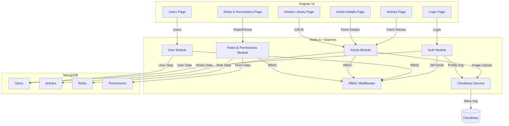
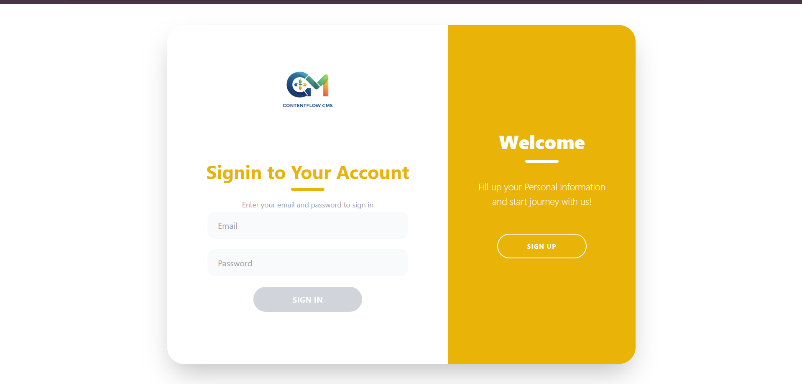
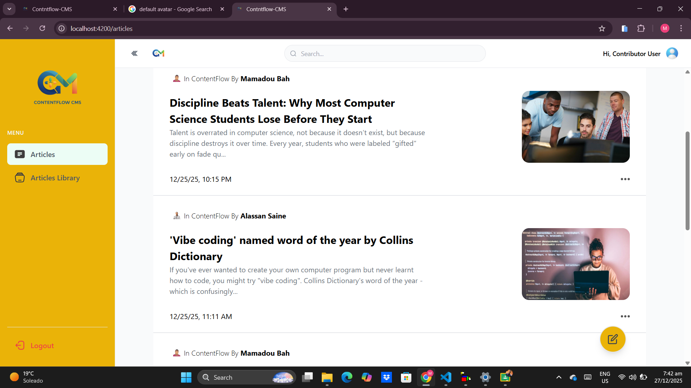
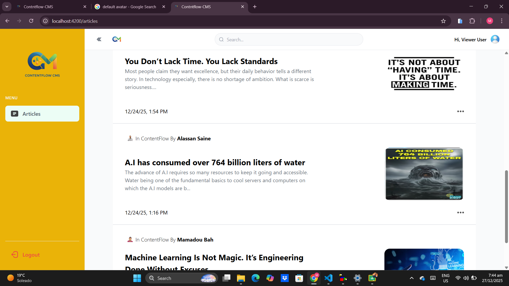
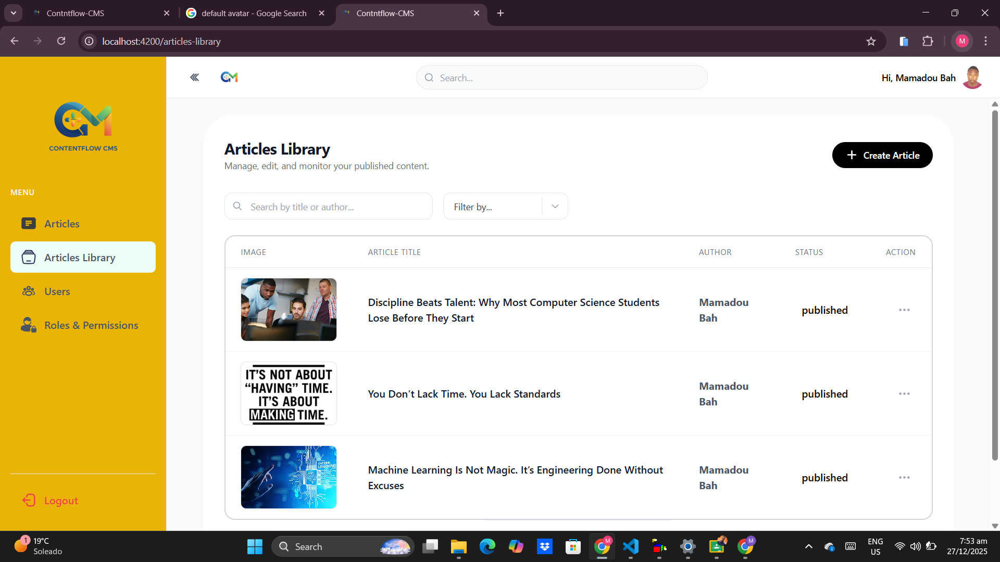
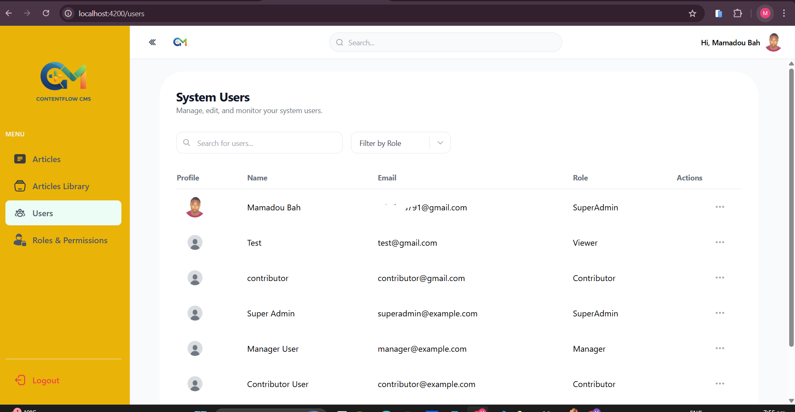
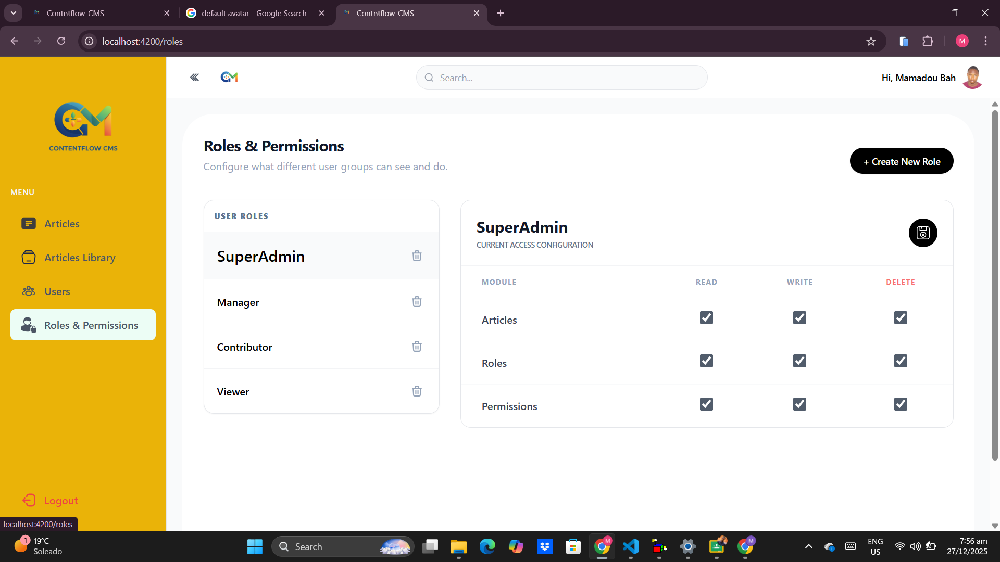

# Content Management System (CMS)
**A robust, scalable full-stack CMS with secure permission-based RBAC**
---

## Project Purpose

This project is a full-stack Content Management System (CMS) engineered for organizations demanding strict, auditable control over content and user actions. It implements true permission-based Role-Based Access Control (RBAC) within the backend—ensuring all operations are explicitly authorized, never trusted to the frontend. The system is designed for scalability, security, and flexibility.

---

## API & Route Reference

### Frontend (Angular) Routes

| Path                | Component/Page         | Description                       |
|---------------------|-----------------------|-----------------------------------|
| `/`                 | Redirect              | Redirects to `/articles`          |
| `/login`            | LoginPage             | User login                        |
| `/articles`         | ArticlesPage          | List all articles                 |
| `/articles/:id`     | ArticleDetails        | View article details              |
| `/articles-library` | ArticlesLibrary       | Article library (CRUD)            |
| `/users`            | UsersPage             | Manage users (admin/manager only) |
| `/roles`            | RolesPage             | Manage roles & permissions        |

---

### Backend (Express API) Endpoints

#### Auth Routes (`/auth`)
| Method | Path             | Description                | Auth Required |
|--------|------------------|----------------------------|---------------|
| POST   | `/register`      | Register new user          | No            |
| POST   | `/login`         | Login                      | No            |
| POST   | `/logout`        | Logout                     | No            |
| POST   | `/refresh`       | Refresh access token       | No            |
| POST   | `/revoke-token`  | Revoke refresh token       | Yes           |
| GET    | `/me`            | Get current user profile   | Yes           |

#### User Routes (`/users`)
| Method | Path         | Description                | Auth Required | Permission         |
|--------|--------------|----------------------------|---------------|--------------------|
| GET    | `/`          | List all users             | Yes           | `view_users`       |
| GET    | `/:id`       | Get user by ID             | Yes           | `view_users`       |
| PUT    | `/:id`       | Change user role           | Yes           | `change_user_role` |


#### Role Routes (`/roles`)
| Method | Path                | Description                  | Auth Required | Permission           |
|--------|---------------------|------------------------------|---------------|----------------------|
| POST   | `/`                 | Create new role              | No            | -                    |
| GET    | `/`                 | List all roles               | No            | -                    |
| GET    | `/:id`              | Get role by ID               | No            | -                    |
| PUT    | `/:id`              | Update role                  | No            | -                    |
| DELETE | `/:id`              | Delete role                  | No            | -                    |
| PUT    | `/:id/permissions`  | Set role permissions         | No            | -                    |

#### Permission Routes (`/permissions`)
| Method | Path         | Description                | Auth Required |
|--------|--------------|----------------------------|---------------|
| GET    | `/`          | List all permissions       | No            |

#### Article Routes (`/articles`)
| Method | Path                | Description                        | Auth Required | Permission           |
|--------|---------------------|------------------------------------|---------------|----------------------|
| POST   | `/`                 | Create article                     | Yes           | `create_article`     |
| GET    | `/:id`              | Get article by ID                  | Yes           | `view_article`       |
| GET    | `/`                 | List all articles                  | Yes           | `view_article`       |
| PUT    | `/:id`              | Update article                     | Yes           | `edit_article`       |
| DELETE | `/:id`              | Soft delete article                | Yes           | `delete_article`     |
| PUT    | `/:id/restore`      | Restore soft-deleted article       | Yes           | `restore_article`    |
| PUT    | `/:id/publish`      | Publish article                    | Yes           | `publish_article`    |

---
## Core Features
##  Core Features

### Authentication & Security

<p align="center">
    
</p>


---
<!-- YOLO test -->


<table>
        <td align="center"><br>Angular</td>
        <td align="center"><br>TypeScript</td>
        <td align="center"><br>Node.js</td>
        <td align="center"><br>Express</td>
        <td align="center"><br>MongoDB</td>
        <td align="center"><br>Tailwind CSS</td>
        <td align="center"><br>Vercel</td>
        <td align="center"><br>Cloudinary</td>
    </tr>
</table>

---

## System Architecture


---

## Key Features

###  Authentication & Security
- **JWT Authentication** (access/refresh tokens)
- **Strong password requirements**
- **Session management** and token refresh
- **Secure password hashing** (bcrypt)
- **CORS** and HTTP security headers

###  Permission-Based RBAC
- **Backend-enforced permissions** 
- **Fine-grained permissions** (e.g., `article:publish`, `user:manage`)
- **Dynamic, seedable roles**
- **Role assignment + protected system roles** (SuperAdmin, Manager, Contributor, Viewer)
- **Permission middleware** for all protected routes

###  Article Lifecycle Management
- **Draft, edit, delete, publish, and view articles** (permission-mapped)
- **Image upload with Cloudinary**

###  User & Role Management
- **User CRUD** (create, edit, delete, update)
- **Role assignment** with visual feedback
- **User status (active/suspended)**
- **System roles protected**


###  Secure, Scalable Authorization
- **MongoDB-persisted permissions & roles**
- **Authorization enforced via middleware**
- **Comprehensive error handling**

###  Modern RESTful API
- **Consistent, versioned endpoints**
- **RESTful best practices**
- **Standardized responses**

###  Modern, Role-Aware Frontend
- **Angular + Tailwind CSS UI**
- **Protected routes & access guards**

- **Responsive, mobile-first**
- **Theme/dark mode** *(planned)*
- **Toasts & notifications**


---

## Technology Overview

| Layer    | Main Tools    | Highlights |
|----------|---------------|------------|
| Backend  |  <br>  <br>  <br>  | JWT, Permissions Middleware |
| Frontend |  <br>  <br>  | Route Guards, Animations |
| Auth     |  <br>  | Secure tokens & sessions |
| DevOps   |  <br>  <br>  | GitHub Actions (planned) |
| Cloud    |  | Image upload |

---

##  Project Structure

```
Content-Management-System/
├── client/         # Angular frontend
│   ├── src/
│   └── ...
├── server/         # Node.js backend
│   ├── config/
│   ├── controller/
│   ├── middleware/
│   ├── model/
│   ├── route/
│   ├── service/
│   ├── utils/
│   └── ...
├── docs/           # Documentation and assets
├── README.md
└── ...
```

---

##  Getting Started

### 1.  Clone the repository

```bash
git clone https://github.com/Mamadou8bah/content-management-system.git
cd content-management-system
```

---

### 2. 🔧 Backend Setup

```bash
cd server
npm install
node index.js
```
<sub><sup>Defaults to http://localhost:3000 </sup></sub>

---

### 3. 💻 Frontend Setup

```bash
cd client
npm install
ng serve
```
<sub><sup>Frontend available at http://localhost:4200 </sup></sub>

---

### 4. 🗝️ Environment Variables

Add a `.env` file in `server/`:

```env
MONGO_URI=mongodb://localhost:27017/cms-example
JWT_SECRET=a-very-strong-secret
PORT=3000
CLOUDINARY_CLOUD_NAME=your-cloud-name
CLOUDINARY_API_KEY=your-api-key
CLOUDINARY_API_SECRET=your-api-secret
```

---

### 5. 🌐 Access the Application

- Frontend: [http://localhost:4200](http://localhost:4200)

---

## Live Visual Demo


---

## 🌉 Example Role Permissions

| **Role**      | Can View  | Edit  | Delete | Publish | Manage Users | Manage Roles | 
|---------------|-----------|-------|--------|---------|--------------|--------------|
| SuperAdmin    | Yes       | Yes   | Yes    | Yes     | Yes          | Yes          |
| Manager       | Yes       | Yes   | Yes    | Yes     | Yes (limited)| No           |
| Contributor   | Yes       | Yes   | Yes    | No      | No           | No           |
| Viewer        | Yes       | No    | No     | No      | No           | No           |

*All UI sections and API endpoints are protected by backend-enforced permissions.*

---

## Screenshots

Below are screenshots of key pages and features of the CMS:

### Login Page


### Dashboards by Role
- **SuperAdmin**
  
    
- **Contributor**
  
    
- **Viewer**
  
    

### Articles Library


### Users Page


### Roles & Permissions


---

## Advanced Notes

- **Backend-Only Security:** RBAC and permissions logic enforced in Express middleware; frontend cannot elevate privileges.
- **Seeded Roles & Permissions:** First-time startup seeds standard roles and permissions with protections.
- **Frontend Guards:** Improve UX, but **all real authorization** is backend-only.
- **Easy Extension:** Add permissions or roles in seconds—built for scale.
- **Auditability:** Expansion planned for full audit logs.
- **Cloudinary Integration:** Secure, scalable image uploads.
- **Planned:** Multi-language, accessibility, more.

---

## Contributing

1. Fork the repo and create your branch:  
   `git checkout -b feature/your-feature`
2. Commit your changes:  
   `git commit -am 'Add some feature'`
3. Push to your fork:  
   `git push origin feature/your-feature`
4. Submit a pull request

See [CONTRIBUTING.md](./CONTRIBUTING.md) (coming soon) for guidelines.

---

## FAQ

**Q:** Does frontend route-guarding mean it's secure if I hide links?  
**A:** No! Security is enforced only by backend permissions.

**Q:** Can I add more roles (“Editor”, “Moderator”, etc)?  
**A:** Yes—add the role and assign permissions via seeding or DB. The UI adapts.

**Q:** How are roles and permissions managed?  
**A:** They are MongoDB collections, referenced on users and enforced via middleware.

**Q:** Is this CMS production-ready?  
**A:** Yes—but review/adjust all security, env, deployment settings for your needs.


---

## Maintainer

**Mamadou Bah**  
*fullstack developer*  
[](https://github.com/Mamadou8bah)

---


## License

[](./LICENSE)

---

> Designed for teams who value auditable, robust, and modern content platforms—where “who can do what” is always crystal clear.